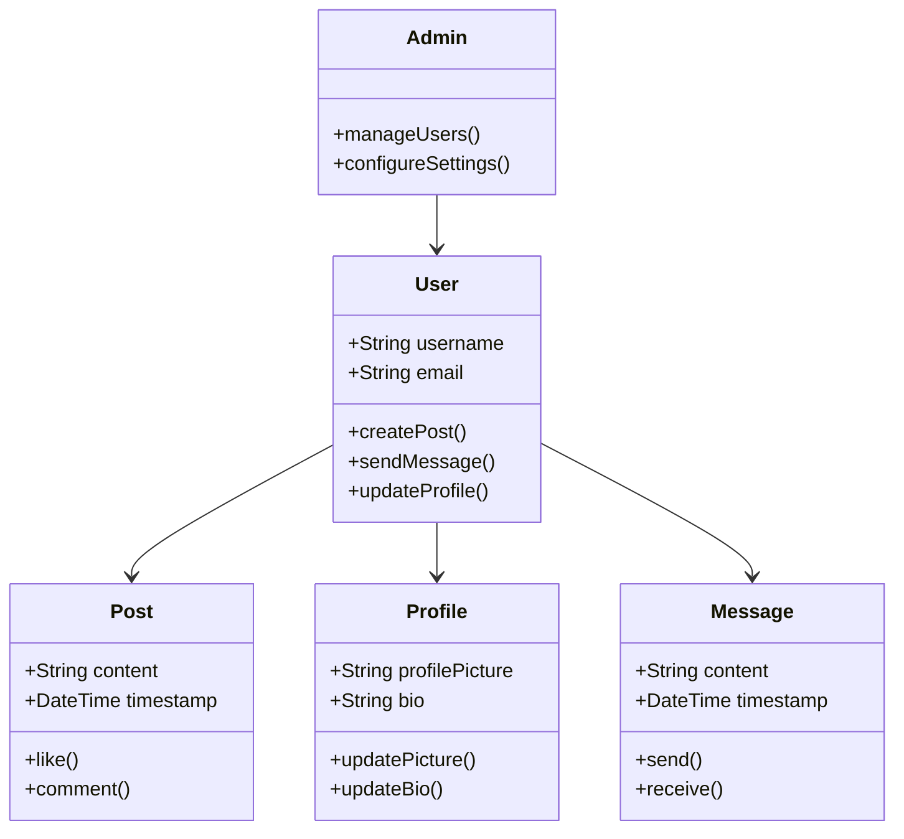
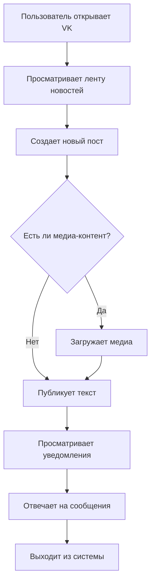
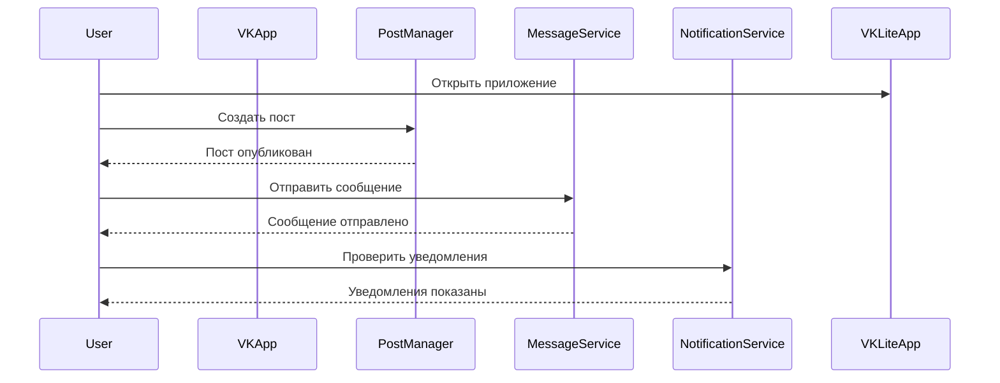

# is_32k
____________________________________________________________________________________________
# VK 

**VK** — это социальная сеть ВКонтакте, разработанная для пользователей, которые хотят наслаждаться основными функциями социальной сети без перегрузки дополнительными опциями. Платформа ориентирована на быструю и простую навигацию, позволяя пользователям общаться, обмениваться контентом и управлять своим профилем.

## Основные возможности

1. **Социальная сеть**:
   - Обмен сообщениями и комментариями.
   - Просмотр и лайкинг постов.
   - Поддержка создания и управления группами и страницами.

2. **Управление профилем**:
   - Настройка личной информации и фотографий.
   - Просмотр истории активности и уведомлений.

3. **Медиа-контент**:
   - Загрузка и просмотр фотографий и видео.
   - Создание и прослушивание музыкальных плейлистов.

4. **Безопасность и конфиденциальность**:
   - Настройка приватности профиля.
   - Инструменты для защиты от спама и нежелательных сообщений.

## Пользовательские роли

1. **Посетитель**:
   - Просмотр общедоступных профилей и контента.

2. **Пользователь**:
   - Общение с друзьями, публикация постов и медиа-контента.
   - Управление настройками профиля и приватности.

3. **Модератор**:
   - Управление содержимым групп и страниц.
   - Модерация комментариев и сообщений.

4. **Администратор**:
   - Управление пользователями и настройками платформы.
   - Настройка глобальных параметров безопасности и конфиденциальности.

## UML Диаграммы

### Диаграмма классов (Class Diagram)

- User — класс пользователя, который может создавать посты, отправлять сообщения и обновлять профиль.
- Post — класс поста с возможностью лайков и комментариев.
- Profile — класс профиля с фотографией и биографией.
- Message — класс сообщений с возможностью отправки и получения.
- Admin — класс администратора, управляющего пользователями и настройками.

- Диаграмма активности иллюстрирует процесс использования VK, включая создание постов, загрузку медиа-контента и управление уведомлениями.

### Диаграмма последовательности (Sequence Diagram)

- Диаграмма последовательности показывает взаимодействие пользователя с приложением VK, включая создание постов, отправку сообщений и проверку уведомлений.

### Архитектурные особенности
#### VK использует клиент-серверную архитектуру для управления социальными взаимодействиями и медиа-контентом. Основные компоненты включают:

- Веб-сервер: обрабатывает запросы пользователей и управляет взаимодействием с базой данных.
- База данных: хранит данные пользователей, посты, сообщения и уведомления.
- API: предоставляет интерфейсы для интеграции с внешними сервисами и мобильными приложениями.

____________________________________________________________________________________________
heheheheh
